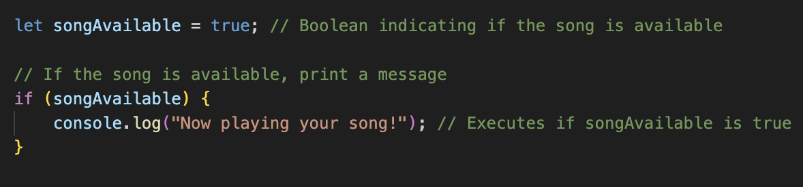
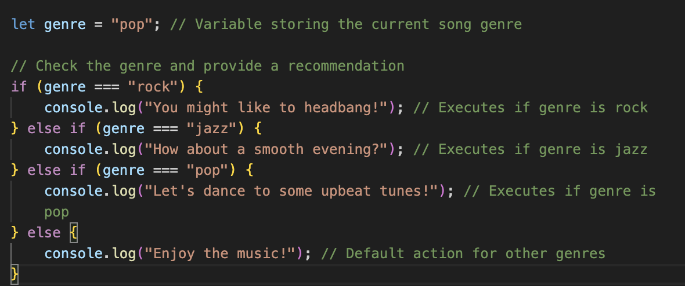
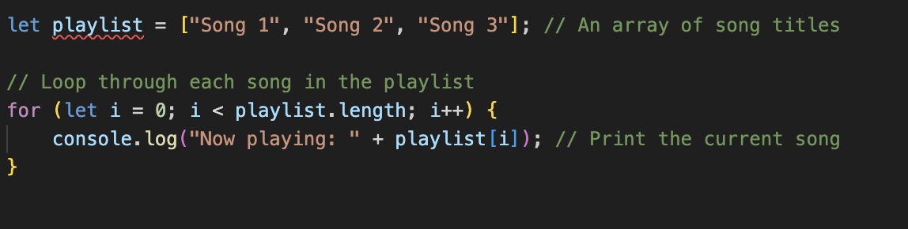
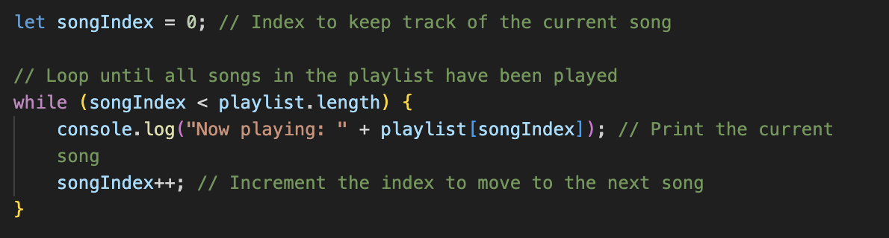
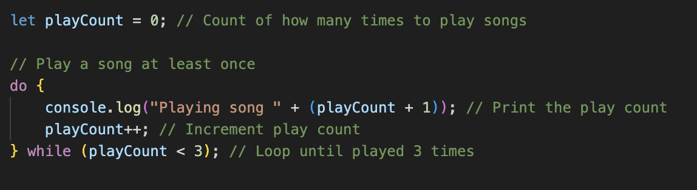
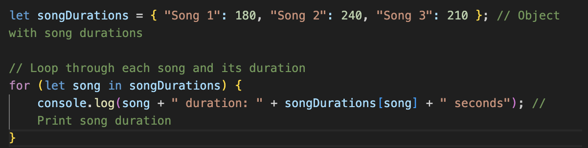
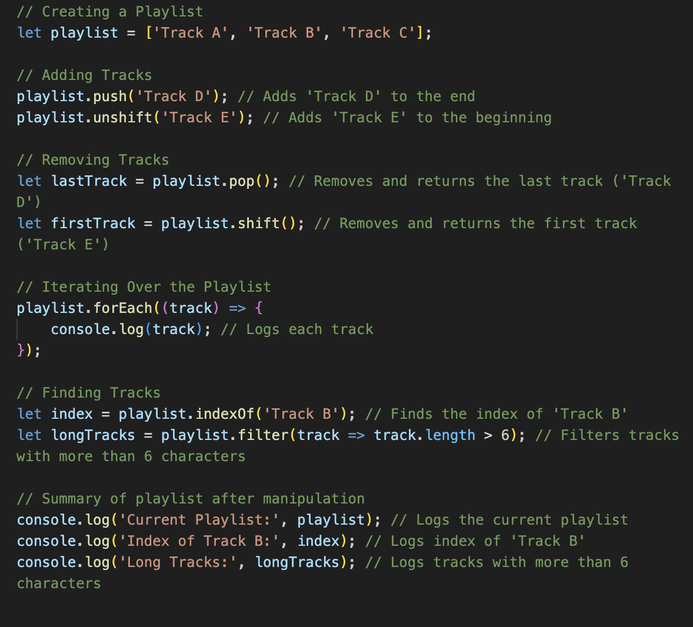
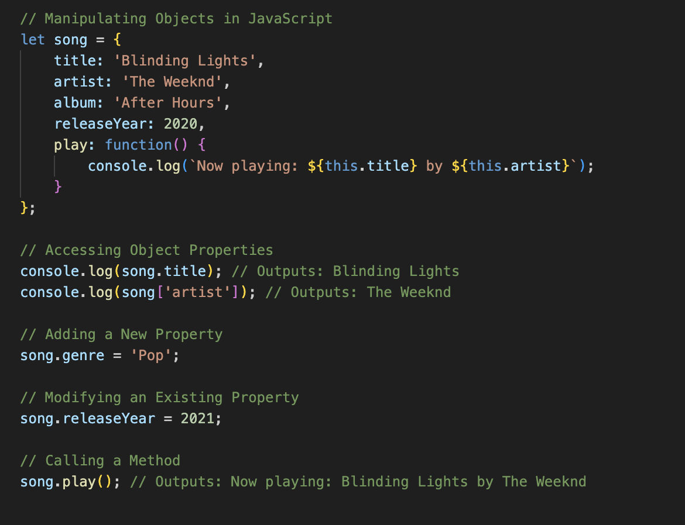
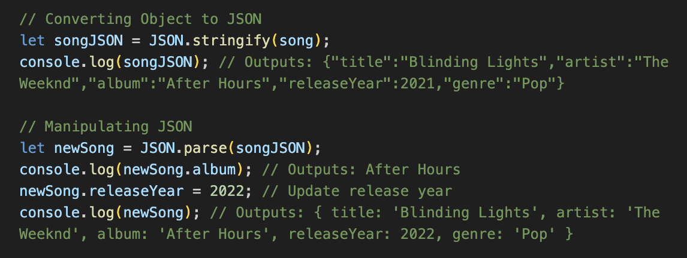

# Question One

We’ve all heard the saying, "Too many cooks in the kitchen." Being part of a large project can feel similar, which is why it’s crucial to have a standard source control process in place. This is especially important as developers change, update, manipulate, and delete code—actions that can compromise the integrity of the project. The process typically begins with the initialization of a version control system, such as Git, where a central repository is created to store the project’s codebase (GitHub, 2024).

Source control systems can be categorized into centralized and distributed models (GitLab, 2024). 

Centralized Version Control Systems (CVCS)
Centralized Version Control System (CVCS) maintain a single central repository, where all version files reside, making it easy to manage access and control changes but creating a single point of reference (GitLab, 2024).

(Atlassian, 2019) 

Distributed Version Control Systems (CVCS)
In contrast, distributed version control systems (DVCS), like Git, allow each developer to maintain their own local repository. This setup enables developers to work offline and commit changes independently. DVCS promotes greater flexibility by allowing developers to work on features in isolation, merging changes into the central repository only when ready (GitLab, 2024).

(Atlassian, 2019) 

Teams typically adopt a branching strategy, often using models like Git Flow or trunk-based development, to manage feature development, bug fixes, and releases. Each team member works on their own branch, allowing for independent changes without affecting the main codebase. Regular commits with descriptive messages help document these changes, creating a clear history of the project’s evolution.

Code reviews are conducted via pull requests (PRs), where team members can review, discuss, and suggest modifications before merging changes into the main branch. This process ensures code quality and minimizes the risk of introducing bugs (Ernst, 2022).

To further streamline the process, continuous integration (CI) tools are implemented to automate the testing of new code. CI ensures that new changes meet predefined standards and pass all tests before being integrated into the project. Additionally, the process involves tagging stable releases and maintaining documentation that outlines the repository structure, coding standards, and branching strategies (Atlassian, 2019).

Overall, this structured approach not only enhances collaboration but also contributes to the reliability and maintainability of the software.

# Question Two

Quality software is defined by several essential attributes that ensure it effectively meets user needs, performs consistently, and can adapt to future requirements.

The first aspect is **functionality**, which encompasses the software’s ability to deliver the features and capabilities that users expect. This involves not only fulfilling specified functional requirements but also addressing non-functional requirements related to how well those functions are executed (Butinar, 2023).

Next, **usability** is crucial for ensuring that users can interact with the software easily and intuitively. A strong focus on usability means creating interfaces and workflows that minimize complexity and enhance user satisfaction, making the software accessible to a wider audience (Apr 28 & Am, 2023).

The third aspect, **reliability**, refers to the software's ability to perform consistently under specified conditions over time. Reliable software should operate without failure, even in unexpected scenarios, and should be able to recover effectively from errors (Iyer, 2024).

**Testability** is another vital characteristic, indicating how easily software can be tested for defects and performance issues. High testability simplifies the process of identifying bugs and verifying that the software meets its requirements, ultimately leading to a more robust final product (Butinar, 2023).

Following this, **security** has become increasingly important, particularly in the context of rising cyber threats. Quality software must implement strong security measures to safeguard against unauthorized access and data breaches, thereby ensuring the integrity of user data and maintaining trust (Butinar, 2023).

Lastly, **scalability** reflects the software’s ability to handle increased loads or adapt to growing user demands without a decline in performance. Scalable software can efficiently manage growth, making it a vital characteristic for applications expected to expand over time (Butinar, 2023).

Together, these six characteristics— **functionality, usability, reliability, testability, security, and scalability** —create a comprehensive framework for evaluating software quality. They ensure that the software is not only effective and user-friendly but also secure and adaptable in a dynamic environment.

# Question Three

A typical high-level structure of a MERN (MongoDB, Express, React, Node.js) stack application includes four essential components, each contributing to the overall architecture and functionality of the app.

MongoDB serves as the database layer, utilizing a NoSQL structure that allows for flexible data storage in a JSON-like format known as BSON (MongoDB, n.d.). This flexibility is particularly beneficial for applications with rapidly changing data requirements, as it permits dynamic schemas and easy scalability. MongoDB's document-oriented approach enables developers to work with complex data structures while maintaining high performance and reliability (MongoDB, n.d.).

Next is Express, a minimalist web application framework built on top of Node.js. It simplifies the development of robust APIs by providing essential middleware functions for handling HTTP requests and responses, facilitating routing, and managing sessions and cookies. Express allows developers to build RESTful APIs efficiently, enabling seamless communication between the front-end and back-end (MongoDB, n.d.).

On the client side, React empowers developers to create interactive and dynamic user interfaces through a component-based architecture. This approach allows for the reuse of components across the application, leading to more maintainable and efficient code. React's Virtual DOM optimizes rendering, ensuring that updates to the UI are efficient and responsive, which enhances the overall user experience (Gill, 2024).

Finally, Node.js serves as the foundation of the stack, providing a JavaScript runtime environment that enables server-side scripting. Its event-driven, non-blocking I/O model makes it particularly well-suited for building scalable network applications, allowing developers to handle multiple connections simultaneously without performance degradation (Node.js Web Application Architecture, 2021).

In a typical MERN application, the flow of data begins with the React front-end making API calls to the Express server. The server processes these requests, interacts with the MongoDB database to retrieve or manipulate data, and sends the results back to the React application, thereby completing the cycle of data exchange. This architecture supports a clear separation of concerns, enhances maintainability, and facilitates the development of scalable web applications (GeeksforGeeks, 2019).

# Question Four

To successfully develop a website for a small business, a team must possess a comprehensive set of skills and knowledge that span both technical and non-technical domains. First and foremost, proficiency in essential programming languages is crucial. HTML (HyperText Markup Language) and CSS (Cascading Style Sheets) are foundational for creating the structure and style of web pages, while JavaScript is necessary for adding interactivity and dynamic content (Smith, 2024). Familiarity with modern frameworks and libraries, such as React, Angular, or Vue.js, can greatly enhance development efficiency and user experience by allowing developers to build responsive and scalable web applications (Berning, 2017).

Moreover, understanding back-end development is vital. This includes knowledge of server-side programming languages such as PHP, Python, or Node.js, which facilitate the creation of robust server applications that manage data and business logic. Additionally, expertise in database management systems, such as MySQL or MongoDB, is essential for storing, retrieving, and manipulating data efficiently (W3Schools, 2023). Security is another critical area; developers need to implement best practices to protect sensitive information and ensure safe user interactions.

In addition to technical skills, the team should be well-versed in user experience (UX) and user interface (UI) design principles. This includes understanding user-centered design, accessibility standards, and usability testing to create a website that is not only visually appealing but also intuitive and easy to navigate (W3C, 2016). Knowledge of search engine optimization (SEO) is also important, as it helps the website rank higher in search engine results, thereby increasing visibility to potential customers (Goodwin, 2023).

Project management skills are equally important for keeping the project organized and ensuring that deadlines are met. Familiarity with methodologies such as Agile or Scrum can enhance collaboration and adaptability throughout the development process (Atlassian, 2019). Furthermore, effective communication skills are vital for liaising with clients, understanding their requirements, and incorporating their feedback into the development process. This collaborative approach ensures that the final product aligns closely with the client’s vision and business goals (Atlassian, 2019).

In summary, a successful web development project for a small business requires a multidisciplinary approach that combines technical expertise, design sensibility, project management, and strong communication skills. This holistic skill set enables the team to deliver a high-quality, functional, and user-friendly website that meets the specific needs of the business.

# Question Five
The project referenced here is the Six-Letter Word Game, available on GitHub.

Successfully completing this terminal application, inspired by Wordle, required a diverse range of knowledge and skills while navigating several challenges. The primary objective was to create a user-friendly interface that allowed players to guess a six-letter word within eight attempts, while managing player data and scores.

Achieving this necessitated a solid foundation in programming, file handling, user interface design, and project management. The following outlines the essential skills and knowledge needed, along with the obstacles encountered.

## Technical Knowledge and Skills Required

- Programming Proficiency in Python
A solid understanding of Python, particularly its syntax and object-oriented programming (OOP) principles, is essential. This includes using classes, such as `WordGame` and `Responsiveness`, to encapsulate functionality, demonstrating proficiency in OOP concepts.

- Data Structures
Familiarity with various data structures—such as lists, dictionaries, and sets—is vital for managing player data and scores. Sets, in particular, are useful for efficiently storing valid six-letter words, allowing for quick lookups during gameplay. This knowledge supports effective data management and enhances the game’s performance.

- File Handling
Understanding file I/O operations in Python is necessary to read from text files (e.g., `sixletterwords.txt`). Implementing robust data validation ensures that only valid six-letter words are processed, thereby enhancing the game’s reliability and user experience.

- User Interface Design
Creating an engaging user interface in a terminal application involves implementing color-coded feedback using libraries like `colorama`. This aspect enhances user experience by providing visual cues that guide players throughout the game. Knowledge of console output manipulation is essential to achieve this effect.

- Project Management
Utilizing project management tools, such as Trello, helps organize tasks, set deadlines, and track progress throughout the development process. Effective project management skills are critical for planning and executing the project within the designated timeframe.

- Debugging and Testing
A methodical approach to debugging and testing is crucial for identifying and resolving issues that may arise during development. This includes testing various game scenarios to ensure robustness and handling edge cases, such as invalid guesses, to create a smooth user experience.

## Overcoming Challenges

Throughout the development process, various challenges arose that required careful consideration and problem-solving.

- User Management
Implementing user input validation was a key challenge, as it ensures that inputs meet criteria for word length and validity against the word list. Careful handling of user input errors is necessary to improve the overall experience and maintain the integrity of the game.

- Game Logic
Developing the logic for the game involved defining how guesses are evaluated, particularly distinguishing between correct and incorrect letters. Clear properties and methods within the game’s classes were essential for managing this logic effectively, ensuring an engaging gameplay experience.

- User Functionality
Creating a structured visual feedback system that provides indicators (green, yellow, white) for player guesses required thoughtful design. This involved processing and displaying results in an intuitive manner for players, with iterative refinement based on testing feedback.

- Scoreboard Management
Managing the scoreboard and player statistics presented challenges in ensuring accurate updates after each game. Implementing structured data management techniques was necessary for effectively tracking wins, losses, and total games played, which ultimately enhanced player engagement.

- Time Management
Balancing project deadlines with the need to learn new concepts was a challenge, especially when obstacles arose. Breaking tasks into smaller, manageable components and setting mini-deadlines for each helped maintain progress and ensure timely completion.

By leveraging skills in Python programming, data structures, user interface design, and project management, I was able to create an engaging gameplay experience. Overcoming challenges such as user input validation, game logic development, and scoreboard management deepened my understanding of these concepts and enhanced my overall development skills. This project served as a valuable learning opportunity, equipping me with essential tools for future software development endeavors.

# Question Six

This analysis encompasses key aspects such as programming proficiency in Python, data structures, control flow, user interface design, and project management. By examining the strengths demonstrated and the constructive feedback received, I will propose actionable changes for future projects of a similar nature. This approach not only highlights my growth as a developer but also sets the stage for enhancing both functionality and user experience in subsequent endeavors.

Evaluation of Knowledge and Skills
- Programming Proficiency in Python: 
My solid foundation in Python proved invaluable in implementing the core functionality of the Six-Letter Word Game. I effectively utilized object-oriented programming principles, creating classes like `WordGame` and `Responsiveness` to organize my code and improve manageability. For example, the clear structure allowed me to maintain and modify game states easily. However, I recognize the need for improvement in file handling, as pointed out by my educator: “For file handling, there is only reading from a file but no writing to a file.” Adding file-writing capabilities in future iterations would enable the application to save player scores and histories, thereby enhancing the user experience.

- Data Structures and Error Handling: 
My effective use of data structures, such as lists and dictionaries, was instrumental in managing player data and game states. I incorporated error handling that provided clear feedback for invalid inputs, ensuring that the game remained user-friendly. For instance, when a player guessed a word that was not six letters long, the application prompted them to try again without crashing, which maintained the flow of the game. Moving forward, I will focus on implementing more robust error-checking mechanisms, especially concerning installation processes. The educator's feedback highlighted this need: “The simple script written does not check if Python/pip/venv is installed,” which would streamline the setup process for users.

- Control Flow and Logic Implementation: 
I demonstrated a nuanced understanding of control structures by effectively utilizing loops and conditionals to create a dynamic game flow. This allowed for real-time feedback based on player guesses, ensuring an engaging experience. For example, the game logic provided immediate responses to player inputs, clearly indicating correct and incorrect letters. However, I recognize the need for clearer feature descriptions and more accurate flowchart designs, as noted in the educator's feedback: “The icons used in the flowchart are incorrect.” Enhancing the documentation and visual representation of logic in future projects will be a priority.

- User Interface Design: 
My implementation of color-coded feedback through the `colorama` library significantly improved user interaction, providing visual clarity in the terminal. Players could easily identify correct guesses, enhancing their engagement with the game. For instance, using color indicators for different guess outcomes added a layer of fun and strategy to the experience. However, I need to refine my installation instructions to be more user-friendly, as the educator mentioned: “The installation steps have an incorrect step” (Coderacademy, 2024). By providing explicit and accurate guidance, I can better assist users, particularly those with less technical expertise.

- Project Management and Version Control: 
I effectively utilized version control to manage my project; however, I recognized that my commit messages were sometimes too simplistic or lacked meaningful descriptions. Despite adhering to DRY (Don’t Repeat Yourself) principles throughout my codebase, which helped keep my code clean and efficient, I see room for improvement in my project management practices. The educator's feedback emphasized this point: “Several commits are either not meaningful or too simple to be considered a proper commit.” In future projects, I will strive to ensure that my commit messages are more informative, reflecting the changes made and providing a clearer history of the project’s development.

In conclusion, this project allowed me to effectively apply and evaluate my knowledge and skills. While I succeeded in many areas, the feedback I received highlighted specific opportunities for improvement. By addressing these areas—particularly in file handling, error management, and documentation—I can enhance the overall quality and user experience of future projects. This reflective process not only solidifies my understanding but also prepares me for more complex challenges ahead.

# Question Seven

Control flow refers to the order in which individual statements, instructions, or functions are executed or evaluated in a program. This is generally read and executed in order from left-to-right, top-to-bottom (Codecademy, n.d.)))). Control flow has many mechanisms, including conditional statements, loops, and switch statements, each with different variants and serving different purposes.

1. Conditional statements
Conditional statements in JavaScript enable your program to choose different paths based on certain conditions. They are fundamental in decision-making processes within your code and can be broken down into "if", "else-if", and "else" statements.

- If Statements
The "if" statement evaluates a condition and executes the associated block of code only if the condition is true. This mechanism allows for simple decision-making (Mozilla Developer Network, n.d.).

Example:
A check to see if a song is available before playing it:

Here, the condition checks if `songAvailable` is true. If it is, the program informs the user that the song is now playing. If it’s false, nothing happens.

- Else-if statement
In the previous example, we looked at two distinct outcomes. The "else-if" statement allows for multiple conditions to be evaluated in sequence. This is particularly useful when you have more than two potential outcomes (Mozilla Developer Network, n.d.).

Example:
A program that checks the genre of a song to recommend an action:

This structure allows for customized messages based on the genre of music, providing a personalized experience for the user. 

- Else statement
As we saw in the previous example, the "else" statement provides a default action if none of the conditions are met. This helps ensure that there’s always a response, even if the input doesn’t match any of the expected values.

2. Loops

Loops in JavaScript allow a condition to be repeated through a block of code. They are essential for automating tasks and processing collections of data without having to deal with repetitive code. Loops can be found using the "for", "while", "do while", and "for...of" and "for...in" loop methods (Mozilla Developer Network, n.d.).

- For Loops
For loops are useful for iterating over a collection, such as a playlist. The `for` loop is particularly handy when you know in advance how many times you want to iterate (Mozilla Developer Network, n.d.).

Example:
Iterating through a playlist:

This code prints each song in the playlist, demonstrating how loops can efficiently handle collections of items.

- While Loops
A `while` loop continues executing as long as a specified condition is true. This type of loop is useful when the number of iterations is not known ahead of time (Mozilla Developer Network, n.d.).

Example:
Playing songs in a playlist until all songs are played:

Here, the loop continues until `songIndex` equals the length of the playlist, ensuring all songs are played.

- Do While
A `do while` loop executes at least once before checking the condition, making it useful for scenarios where you want the code to run before validating the loop condition (Mozilla Developer Network, n.d.).

Example:
Playing a song a specific number of times:

This loop ensures that the song is played at least once, even if the condition to stop is already true.

- For...of and For...in loops
These loops are used for iterating over iterable objects (like arrays) and object properties, respectively (Mozilla Developer Network, n.d.).

Example:
Using a `for...in` loop to display song durations:

This code iterates over the properties of the `songDurations` object, displaying the duration for each song.

3. Logical Operators
Logical operators enhance conditional statements by allowing the combination and negation of boolean expressions. They play a crucial role in decision-making processes within programming and can be depicted as follows: AND (`&&`), OR (`||`), and NOT (`!`). These operators help create complex logical conditions that lead to more refined and flexible code (Mozilla Developer Network, n.d.).

- Logical AND (`&&`)
The expression evaluates to true only if both operands are true

- Logcial OR (`||`)
The expression evaluates to true if atleast one operand is true

- Logical NOT (`!`)
This negates the truthiness of an operand, turning `true` to `false` and vice versa

Example:
Creating a playlist based on user preferences:

In this case, the program checks the user’s preferences and creates a suitable playlist, demonstrating how logical operators can guide program flow based on user input.

# Question Eight

JavaScript is a loosely-typed language, meaning it does not require the programmer to define variable types (Swati Redhu, 2023). This flexibility allows JavaScript to perform automatic type conversion (or coercion) during operations involving different types of values. Coercion in JavaScript is divided into two types: implicit and explicit, and can be found in various operations like arithmetic, comparisons, and even in a boolean true/false context (BITO, n.d.).

Implicit coercion happens in JavaScript automatically. It detects the need to convert one data type to another to perform an operation. If we look at how this works in an arithmetic, comparison, or boolean context, this is how it might look using an example related to music.

In arithmetic operations, JavaScript automatically converts string values to numbers when needed. Let’s say you're working with song durations (in minutes) and a playlist count.

In this case, `totalTime` results in "32" instead of 5 because the `+` operator is used for string concatenation. JavaScript converts the number 2 into a string and concatenates it to "3", resulting in "32", not the expected sum.

Another example involves comparing two song durations—say, "3 minutes" (as a string) and 3 (as a number). JavaScript will coerce the string to a number.

Finally, for boolean contexts, values are considered either "truthy" or "falsy". This can be demonstrated in `if` statements. Let’s say you're checking whether a playlist has any songs.

In this example, "Your Playlist" is a non-empty string (truthy), so the first block runs. On the other hand, `0` is falsy, so the second block is skipped.

While implicit coercion happens automatically based on JavaScript’s internal rules, explicit coercion occurs when the programmer intentionally converts a value from one type to another (Khan, 2024). This is done using built-in functions like `Number()`, `String()`, and `Boolean()`, or by using operators such as the unary `+` for conversion to a number (Khan, 2024). Like implicit coercion, we can look more closely at how this works in arithmetic, comparison, and boolean contexts, continuing to use music as our example.

In arithmetic contexts, explicit coercion is often performed when you want to ensure a value is treated as a specific type (e.g., converting a string to a number before performing arithmetic operations). You can use `Number()` or the unary `+` operator to explicitly convert strings or other types to numbers (Khan, 2024).

Here, we used `Number(songDuration)` to explicitly convert the string "5" to the number 5. After that, the two numbers are added together, resulting in the correct sum of 7, instead of string concatenation.

Alternatively, you could use the unary `+` operator for explicit conversion:

Both methods achieve the same result, ensuring that the operation is performed numerically.

In comparison operations, explicit coercion is useful when you want to ensure that both values are of the same type before making the comparison (Mozilla Developer Network, n.d.). For example, if you're comparing a string and a number, you can explicitly convert the string to a number using `Number()`.

Here, `Number(songDuration)` explicitly converts the string "3" into the number 3, making the comparison `3 === 3` evaluate to `true`.

Alternatively, you could use `parseInt()` or `parseFloat()` if you expect the string to contain numbers with decimals or other characters.

In boolean contexts, explicit coercion is used to ensure that values are treated as either true or false. The `Boolean()` function is used to explicitly convert a value into a boolean, which is particularly useful when checking conditions like in an `if` statement (GeeksforGeeks, 2022).

In this example, `Boolean(playlist)` explicitly converts the empty string `""` into `false`. Since an empty string is falsy, the second block of the `if` statement is executed, and the message "Playlist is empty" is logged.

Explicit coercion can also be useful when dealing with falsy values that you want to ensure are treated correctly:

)) conclusion

# Question Nine
In programming, data types define the kind of data a variable can store. Understanding these types is essential because they dictate how data is stored, manipulated, and processed by the computer. Each data type has specific behaviors, supported operations, and memory representations, which directly affect both performance and functionality within a program. Data types can generally be divided into primitive types and objects (GeeksforGeeks, n.d.).

JavaScript, like many programming languages, offers a variety of built-in primitive data types. These are the most basic types of data and are immutable, meaning they cannot be changed once created. The seven primitive data types in JavaScript are:

1. Undefined 
This type represents a variable that has been declared but not yet assigned a value. It is automatically assigned to a variable if no initial value is provided (GeeksforGeeks, n.d.).

2. Null
This type signifies the deliberate absence of any object value. It is often used to indicate that a variable is intentionally empty or has been nullified (GeeksforGeeks, n.d.).

3. Boolean
A Boolean represents one of two values: `true` or `false`. It’s commonly used in control flow statements like `if` conditions to make decisions (GeeksforGeeks, n.d.).

4. Number
This type represents numeric values, both integers and floating-point numbers. JavaScript uses the IEEE 754 standard for floating-point arithmetic, which allows it to handle very large and small numbers, though it comes with some precision limitations (GeeksforGeeks, n.d.).

5. String
A string is a sequence of characters used to represent textual data. In JavaScript, strings can be defined using single quotes ('), double quotes ("), or backticks (`) for template literals (GeeksforGeeks, n.d.).

6. Symbol
A Symbol is a unique and immutable primitive value, primarily used to create unique object property keys. Symbols help avoid name conflicts in object properties (GeeksforGeeks, n.d.).

7. BigInt
BigInt is a newer primitive type that allows you to work with integers larger than the maximum value allowed by the regular `Number` type (which is 2^53 - 1). BigInt is useful for working with extremely large numbers, such as in cryptography, financial applications, or when handling large datasets (GeeksforGeeks, n.d.).
For example, a string type can represent textual data like the title of a song, such as `"Getaway Car"` by Taylor Swift. Similarly, the number type can be used to represent values like the release year (`2017`) or track duration (`234 seconds`).

The boolean type holds `true` or `false` values, commonly used for conditions, such as determining if a user has liked a song on Spotify: `isLiked = true`. The null type represents the intentional absence of a value, for example, when an artist has no available albums: `const albums = null`;, while undefined indicates that a variable has been declared but not yet assigned a value, like when a playlist hasn’t been set: `let playlist;`.

In contrast, the object type is used to store collections of related data. For example, a JavaScript object representing a Spotify playlist could look like this: `const playlist = { name: "Chill Vibes", tracks: 20, creator: "Jesse" }`;. 
Furthermore, BigInt is useful for storing very large integers that exceed the limit of the regular `number` type. For instance, if an artist like Taylor Swift has 91,100,000 monthly listeners (Spotify, 5 November 2024), you could use BigInt to store that number. However, for display purposes, you might represent it as `91.1M` for easier readability.

# Question Ten
Manipulating Arrays in JavaScript
Arrays in JavaScript are dynamic data structures that can hold multiple values, making them essential for various programming tasks. They come equipped with numerous built-in methods that facilitate the manipulation of their elements. Below, we will explore some fundamental operations, using examples from the provided code.

The code snippet demonstrates various operations on a playlist in JavaScript, focusing on a list of tracks. Initially, a playlist named playlist is created with three elements: `'Track A'`, `'Track B'`, and `'Track C'`. Tracks are then added using the `push()` method, which appends `'Track D'` to the end of the playlist, and the `unshift()` method, which adds `'Track E'` to the beginning. After these additions, the playlist contains `['Track E', 'Track A', 'Track B', 'Track C', 'Track D']`.

Subsequently, tracks are removed from the playlist using the `pop()` method, which removes the last track `('Track D')` and returns it, leaving the playlist as `['Track E', 'Track A', 'Track B', 'Track C']`. The `shift()` method is then used to remove the first track `('Track E')`, resulting in the playlist being `['Track A', 'Track B', 'Track C']`.

To display the tracks, the `forEach()` method is utilized, which iterates over each element in the playlist and logs each track to the console. The code also includes operations to find specific tracks, using the `indexOf()` method to get the index of `'Track B'`, which is 1. Additionally, the `filter()` method is employed to create a new array containing tracks with more than six characters. However, since none of the current tracks meet this criterion, the result is an empty array.

Finally, the current state of the playlist, the index of `'Track B'`, and the list of long tracks are logged to the console, summarizing the playlist's contents after the various manipulations. Overall, this code illustrates basic playlist manipulation techniques, including adding, removing, iterating, and filtering tracks in JavaScript.

# Question Eleven

In JavaScript, objects are versatile data structures that allow developers to store collections of key-value pairs. They are essential for organizing and managing data in a structured way. Below, we will explore how objects can be created and manipulated, using examples.

The example showcases a `song` object, which includes properties such as `title`, `artist`, `album`, and `releaseYear`, along with a method called `play`. You can access properties using dot notation (e.g., `song.title`) or bracket notation (e.g., `song[artist]`). New properties can be added dynamically, such as `song.genre = 'Pop`, and existing properties can be modified, like updating `song.releaseYear` to 2021. Methods within objects can be invoked like standard functions; calling `song.play()` outputs "Now playing: Blinding Lights by The Weeknd." This manipulation of objects allows for efficient organization and retrieval of music-related data in JavaScript.

# Question Twelve

JSON (JavaScript Object Notation) is a simple and lightweight format for data exchange that is both human-readable and machine-readable. It is commonly used in JavaScript for transmitting data between the server and the client. In the following sections, we'll look at how to work with JSON data in JavaScript.

In the example, the `song` object is converted into a JSON string using `JSON.stringify()`, resulting in `songJSON`, which holds a textual representation of the object. This is particularly useful for sending data between a client and a server, as well as for storing information in a structured format. The output of `console.log(songJSON)` shows the object as a JSON string. To manipulate JSON data, `JSON.parse()` is employed to convert the JSON string back into a JavaScript object. In this case, `newSong` holds the parsed object, allowing for straightforward access to its properties. For example, retrieving `newSong.album` outputs "After Hours." Additionally, properties can be updated easily, as shown by changing `newSong.releaseYear` to 2022. This demonstrates how JavaScript facilitates the manipulation of JSON data, making it an effective tool for managing music-related information in applications.

### References

Atlassian. (2019). Get started with agile project management | Atlassian. Atlassian. https://www.atlassian.com/agile/project-management

Atlassian. (2019). What is version control. Atlassian. https://www.atlassian.com/git/tutorials/what-is-version-control

BERNING, D. (2017, May 27). My Take on the Big Three: React, Angular, and Vue - Dave Berning - Medium. Medium; Medium. https://medium.com/@daveberning/my-take-on-the-big-three-react-angular-and-vue-c82f57fef2ea

BITO. (n.d.). Type coercion in JavaScript: JavaScript explained. BITO. https://bito.ai/resources/type-coercion-javascript-javascript-explained/

BUTINAR, M. (2023, September 1). Don’t Save on Quality: Essential Attributes of Good Software. https://biosistemika.com/blog/dont-save-on-quality-key-attributes-of-software/

ERNST, M. (2022, March 7). Version control concepts and best practices. Washington.edu. https://homes.cs.washington.edu/~mernst/advice/version-control.html

GEEKSFORGEEKS. (2019, October 11). MERN Stack. GeeksforGeeks. https://www.geeksforgeeks.org/mern-stack/

GEEKSFORGEEKS. (2022, March 8). Explain nonboolean value coercion to a boolean one in JavaScript. GeeksforGeeks. https://www.geeksforgeeks.org/explain-non-boolean-value-coercion-to-a-boolean-one-in-javascript/

GEEKSFORGEEKS. (n.d.). JavaScript data types. GeeksforGeeks. Retrieved November 5, 2024, from https://www.geeksforgeeks.org/javascript-data-types/

GILL, N. S. (2024, October 7). Reactjs Project Structure and Best Practices. Xenonstack.com; Xenonstack Inc. https://www.xenonstack.com/insights/reactjs-project-structure

GOODWIN, D. (2023). What Is SEO / Search Engine Optimization? Search Engine Land. https://searchengineland.com/guide/what-is-seo

GITLAB. (2024). What is version control? GitLab. https://about.gitlab.com/topics/version-control/

GITHUB. (2024). What is Version Control? GitHub; GitHub. https://github.com/resources/articles/software-development/what-is-version-control

IYER, J. (2024). What Is Software Quality Assurance, and Why Is It Important? | Turing. Www.turing.com. https://www.turing.com/blog/software-quality-assurance-and-its-importance

KHAN, B. (2024, May 17). Understanding Type Coercion in JavaScript - Beenish Khan - Medium. Medium. https://medium.com/@vdsnini/understanding-type-coercion-in-javascript-aff173bd72b5

MONGODB. (n.d.). MERN Stack Explained. MongoDB. https://www.mongodb.com/resources/languages/mern-stack

MOZILLA DEVELOPER NETWORK. (n.d.). do...while. Retrieved October 30, 2024, from https://developer.mozilla.org/en-US/docs/Web/JavaScript/Reference/Statements/do...while

MOZILLA DEVELOPER NETWORK. (n.d.). Equality comparison and sameness - JavaScript. Retrieved October 30, 2024, from https://developer.mozilla.org/en-US/docs/Web/JavaScript/Equality_comparisons_and_sameness

MOZILLA DEVELOPER NETWORK. (n.d.). for. Retrieved October 30, 2024, from https://developer.mozilla.org/en-US/docs/Web/JavaScript/Reference/Statements/for

MOZILLA DEVELOPER NETWORK. (n.d.). for...in. Retrieved October 30, 2024, from https://developer.mozilla.org/en-US/docs/Web/JavaScript/Reference/Statements/for...in

MOZILLA DEVELOPER NETWORK. (n.d.). for...of. Retrieved October 30, 2024, from https://developer.mozilla.org/en-US/docs/Web/JavaScript/Reference/Statements/for...of

MOZILLA DEVELOPER NETWORK. (n.d.). Logical AND. Retrieved October 30, 2024, from https://developer.mozilla.org/en-US/docs/Web/JavaScript/Reference/Operators/Logical_AND

MOZILLA DEVELOPER NETWORK. (n.d.). Logical OR. Retrieved October 30, 2024, from https://developer.mozilla.org/en-US/docs/Web/JavaScript/Reference/Operators/Logical_OR

MOZILLA DEVELOPER NETWORK. (n.d.). Nullish coalescing. Retrieved October 30, 2024, from https://developer.mozilla.org/en-US/docs/Web/JavaScript/Reference/Operators/Nullish_coalescing

MOZILLA DEVELOPER NETWORK. (n.d.). while. Retrieved October 30, 2024, from https://developer.mozilla.org/en-US/docs/Web/JavaScript/Reference/Statements/while

NODE.JS WEB APPLICATION ARCHITECTURE. (2021, October 17). GeeksforGeeks. https://www.geeksforgeeks.org/node-js-web-application-architecture/

SMITH, C. (2024). Basics of Website Development: A Step-by-Step Guide for 2024. Scandiweb. https://scandiweb.com/blog/basics-of-website-development/

SWATI REDHU. (2023, June 14). Javascript is a loosely typed language. What does that mean?? — Part 7🫤. Medium. https://medium.com/@swati.developer17/javascript-is-a-loosely-typed-language-what-does-that-mean-part-7-a1941662e15c

SPOTIFY. (5 November, 2024). Taylor Swift. Spotify. https://open.spotify.com/artist/06HL4z0CvFAxyc27GXpf02

W3C. (2016, May 6). Accessibility, Usability, and Inclusion. Web Accessibility Initiative (WAI). https://www.w3.org/WAI/fundamentals/accessibility-usability-inclusion/