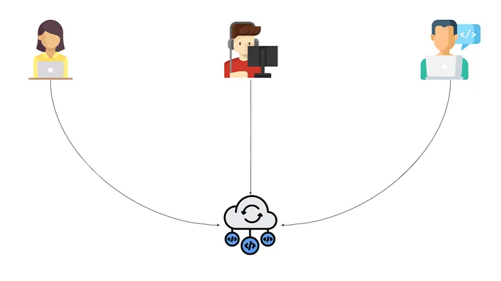
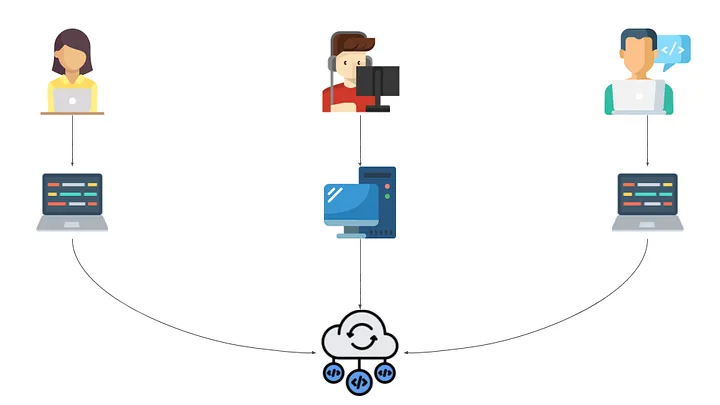

# Question One

We have all heard the saying, "Too many cooks in the kitchen", being apart of a large project can also feel like this and is important to have a standard source control process in place due to developers; changing, updating, manipulating and deleting code in projects that will and can change the integrity of the code. The process typically begins with the initialization of a version control system, such as Git, where a central repository is created to store the project's codebase (Chacon & Straub, 2014).

Source control systems can be categorized into centralized and distributed models. 
Centralized version control systems (CVCS) maintain a single central repository, where all versioned files reside, making it easy to manage access and control changes but creating a single point of failure (Loeliger & McCullough, 2012).

)) reference Altassian

In contrast, distributed version control systems (DVCS), like Git, allow each developer to maintain their own local repository, enabling them to work offline and commit changes independently. This model promotes greater flexibility, as developers can work on features in isolation and merge changes into the central repository when ready (Git Flow, n.d.).

)) reference Altassian

Teams adopt a branching strategy, often employing models like Git Flow or trunk-based development, to manage feature development, bug fixes, and releases. Each team member works on their own branch, allowing them to make changes independently without affecting the main codebase. Regular commits are made with descriptive messages to document changes, fostering a clear history of the project's evolution. Code reviews are conducted through pull requests (PRs), where team members can review, discuss, and suggest modifications before merging changes into the main branch, thereby ensuring code quality and reducing the risk of introducing bugs (Fowler, 2006). Continuous integration (CI) tools are implemented to automate the testing of new code, ensuring that it meets predefined standards and passes all tests before integration. The process also involves tagging stable releases and maintaining documentation that outlines the repository structure, coding standards, and branching strategies. Overall, this structured approach not only enhances collaboration but also contributes to the reliability and maintainability of the software.

References
Chacon, S., & Straub, B. (2014). Pro Git (2nd ed.). Apress.
Fowler, M. (2006). Continuous Integration. Martin Fowler. Retrieved from martinfowler.com
Git Flow. (n.d.). GitFlow Cheatsheet. Retrieved from nvie.com
Loeliger, J., & McCullough, M. (2012). Version Control with Git. O'Reilly Media.

# Question Two

Quality software is defined by several essential attributes that ensure it effectively meets user needs, performs consistently, and can adapt to future requirements. The first aspect is functionality, which encompasses the software’s ability to deliver the features and capabilities that users expect. This involves not only fulfilling specified functional requirements but also addressing non-functional requirements related to how well those functions are executed (Pressman, 2014).

Next, usability is crucial for ensuring that users can interact with the software easily and intuitively. A strong focus on usability means creating interfaces and workflows that minimize complexity and enhance user satisfaction, making the software accessible to a wider audience (Nielsen, 1994). The third aspect, reliability, refers to the software's ability to perform consistently under specified conditions over time. Reliable software should operate without failure, even in unexpected scenarios, and should be able to recover effectively from errors (Beck et al., 2001).

Testability is another vital characteristic, indicating how easily software can be tested for defects and performance issues. High testability simplifies the process of identifying bugs and verifying that the software meets its requirements, ultimately leading to a more robust final product (Meyer, 1997). Following this, security has become increasingly important, particularly in the context of rising cyber threats. Quality software must implement strong security measures to safeguard against unauthorized access and data breaches, thereby ensuring the integrity of user data and maintaining trust (Shostack, 2014).

Lastly, scalability reflects the software’s ability to handle increased loads or adapt to growing user demands without a decline in performance. Scalable software can efficiently manage growth, making it a vital characteristic for applications expected to expand over time (Sommerville, 2011). Together, these six characteristics—functionality, usability, reliability, testability, security, and scalability—create a comprehensive framework for evaluating software quality, ensuring that it is not only effective and user-friendly but also secure and adaptable in a dynamic environment.

References
Beck, K., et al. (2001). Manifesto for Agile Software Development. Agile Alliance.
Meyer, B. (1997). Object-Oriented Software Construction. Prentice Hall.
Nielsen, J. (1994). Usability Engineering. Academic Press.
Pressman, R. S. (2014). Software Engineering: A Practitioner's Approach. McGraw-Hill.
Shostack, A. (2014). Threat Modeling: Designing for Security. Wiley.
Sommerville, I. (2011). Software Engineering. Addison-Wesley.

# Question Three

A standard high-level structure for a MERN (MongoDB, Express, React, Node.js) stack application consists of four key components, each playing an integral role in the overall architecture and functionality of the application.

MongoDB serves as the database layer, utilizing a NoSQL structure that allows for flexible data storage in a JSON-like format known as BSON. This flexibility is particularly beneficial for applications with rapidly changing data requirements, as it permits dynamic schemas and easy scalability. MongoDB's document-oriented approach enables developers to work with complex data structures while maintaining high performance and reliability (MongoDB, 2023).

Next is Express, a minimalist web application framework built on top of Node.js. It simplifies the development of robust APIs by providing essential middleware functions for handling HTTP requests and responses, facilitating routing, and managing sessions and cookies. Express allows developers to build RESTful APIs efficiently, enabling seamless communication between the front-end and back-end (Express, 2023).

On the client side, React empowers developers to create interactive and dynamic user interfaces through a component-based architecture. This approach allows for the reuse of components across the application, leading to more maintainable and efficient code. React's Virtual DOM optimizes rendering, ensuring that updates to the UI are efficient and responsive, which enhances the overall user experience (React, 2023).

Finally, Node.js serves as the foundation of the stack, providing a JavaScript runtime environment that enables server-side scripting. Its event-driven, non-blocking I/O model makes it particularly well-suited for building scalable network applications, allowing developers to handle multiple connections simultaneously without performance degradation (Node.js, 2023).

In a typical MERN application, the flow of data begins with the React front-end making API calls to the Express server. The server processes these requests, interacts with the MongoDB database to retrieve or manipulate data, and sends the results back to the React application, thereby completing the cycle of data exchange. This architecture supports a clear separation of concerns, enhances maintainability, and facilitates the development of scalable web applications (MERN.io, 2022).

References:

Express. (2023). Express.js Documentation. Retrieved from expressjs.com
MongoDB. (2023). MongoDB Documentation. Retrieved from mongodb.com
Node.js. (2023). Node.js Documentation. Retrieved from nodejs.org
React. (2023). React Documentation. Retrieved from reactjs.org
MERN.io. (2022). Getting Started with MERN Stack. Retrieved from mern.io

# Question Four

To successfully develop a website for a small business, a team must possess a comprehensive set of skills and knowledge that span both technical and non-technical domains. First and foremost, proficiency in essential programming languages is crucial. HTML (HyperText Markup Language) and CSS (Cascading Style Sheets) are foundational for creating the structure and style of web pages, while JavaScript is necessary for adding interactivity and dynamic content (W3C, 2023). Familiarity with modern frameworks and libraries, such as React, Angular, or Vue.js, can greatly enhance development efficiency and user experience by allowing developers to build responsive and scalable web applications (Bennett et al., 2021).

Moreover, understanding back-end development is vital. This includes knowledge of server-side programming languages such as PHP, Python, or Node.js, which facilitate the creation of robust server applications that manage data and business logic. Additionally, expertise in database management systems, such as MySQL or MongoDB, is essential for storing, retrieving, and manipulating data efficiently (W3Schools, 2023). Security is another critical area; developers need to implement best practices to protect sensitive information and ensure safe user interactions (OWASP, 2023).

In addition to technical skills, the team should be well-versed in user experience (UX) and user interface (UI) design principles. This includes understanding user-centered design, accessibility standards, and usability testing to create a website that is not only visually appealing but also intuitive and easy to navigate (Norman, 2013). Knowledge of search engine optimization (SEO) is also important, as it helps the website rank better in search engine results, thereby increasing visibility to potential customers (Fishkin, 2015).

Project management skills are equally important for keeping the project organized and ensuring that deadlines are met. Familiarity with methodologies such as Agile or Scrum can enhance collaboration and adaptability throughout the development process (Schwaber & Sutherland, 2020). Furthermore, effective communication skills are vital for liaising with clients, understanding their requirements, and incorporating their feedback into the development process (Smith, 2020). This collaborative approach ensures that the final product aligns closely with the client’s vision and business goals.

In summary, a successful web development project for a small business requires a multidisciplinary approach that combines technical expertise, design sensibility, project management, and strong communication skills. This holistic skill set enables the team to deliver a high-quality, functional, and user-friendly website that meets the specific needs of the business.

References
Bennett, J., et al. (2021). Web Development Essentials. Tech Press.
Fishkin, R. (2015). SEO: The New Media Handbook. O'Reilly Media.
Norman, D. A. (2013). The Design of Everyday Things. Basic Books.
OWASP. (2023). Top Ten Web Application Security Risks. Retrieved from https://owasp.org/
Schwaber, K., & Sutherland, J. (2020). The Scrum Guide. Scrum.org.
Smith, A. (2020). Effective Communication in Web Development. Journal of IT Communication.
W3C. (2023). Web Development Standards. Retrieved from https://www.w3.org/
W3Schools. (2023). Learn SQL. Retrieved from https://www.w3schools.com/sql/

# Question Five
The project referenced here is the SIX-LETTER-WORD-GAME, available here on GitHub.

Successfully completing this terminal application inspired by "WORDLE" required a diverse range of knowledge and skills while navigating several challenges. The primary objective was to create a user-friendly interface that allowed players to guess a six-letter word within eight attempts while managing player data and scores.

Achieving this necessitated a solid foundation in programming, file handling, user interface design, and project management. The following outlines the essential skills and knowledge needed, along with the obstacles encountered.

## Technical Knowledge and Skills Required

- Programming Proficiency in Python:
An understanding of Python, particularly within its syntax and object-oriented programming, is essential. This includes using classes, such as Word_game and Responsiveness, to encapsulate functionalities, demonstrating proficiency in object-oriented principles. 

- Data Structures:
Familiarity with various data structures—such as lists, dictionaries, and sets—is vital for managing player data and scores. Sets, in particular, are useful for efficiently storing valid six-letter words, allowing for quick lookups during gameplay. This knowledge supports effective data management and enhances the game’s performance.

- File Handling:
Understanding file I/O operations in Python is necessary to read from a text file (e.g., sixletterwords.txt). Implementing robust data validation ensures that only valid six-letter words are processed, enhancing the game’s reliability and user experience.

- User Interface Design:
Creating an engaging user interface in a terminal application involves implementing color-coded feedback using libraries like colorama. This aspect enhances user experience by providing visual cues that guide players during the game. Knowledge of console output manipulation is essential for achieving this.

- Project Management:
Utilizing project management tools, such as Trello, helps organize tasks, set deadlines, and track progress throughout the development process. Effective project management skills are critical for planning and executing the project within the designated timeframe.

- Debugging and Testing:
A methodical approach to debugging and testing is crucial for identifying and resolving issues that may arise during development. This includes testing various game scenarios to ensure robustness and handling edge cases, such as invalid guesses, to create a smooth user experience.

## Overcoming Challenges

Throughout the development process, various challenges may arise that require careful consideration and problem-solving.

- User Management:
Implementing user input validation is a key challenge, as it ensures that inputs meet criteria for word length and validity against the word list. Careful handling of user input errors is necessary to improve the overall experience and maintain game integrity.

- Game Logic:
Developing the logic for the game involves defining how guesses are evaluated, particularly distinguishing between correct and incorrect letters. Clear properties and methods within the game’s classes are essential for managing this logic effectively, ensuring an engaging gameplay experience.

- User Functionality:
Creating a structured visual feedback system that provides indicators (green, yellow, white) for player guesses requires thoughtful design. This involves processing and displaying results in a way that is intuitive for players, with iterative refinement based on testing feedback.

- Scoreboard Management:
Managing the scoreboard and player statistics presents challenges in ensuring accurate updates after each game. Implementing structured data management techniques is necessary for effectively tracking wins, losses, and total games played, which enhances player engagement.

- Time Management:
Balancing project deadlines with the need to learn new concepts can be challenging, especially when obstacles arise. Breaking tasks into smaller, manageable components and setting mini-deadlines for each can help maintain progress and ensure timely completion.

By leveraging skills in Python programming, data structures, user interface design, and project management is able to create an engaging gameplay experience. Overcoming challenges such as user input validation, game logic development, and scoreboard management will deepen understanding of these concepts and enhance overall development skills. This project serves as a valuable learning opportunity, equipping developers with essential tools for future software development endeavors.

# Question Six

This analysis encompasses key aspects such as programming proficiency in Python, data structures, control flow, user interface design, and project management. By examining the strengths demonstrated and the constructive feedback received, I will propose actionable changes for future projects of a similar nature. This approach not only highlights my growth as a developer but also sets the stage for enhancing both functionality and user experience in subsequent endeavors.

Evaluation of Knowledge and Skills
- Programming Proficiency in Python: 
My solid foundation in Python proved invaluable in implementing the core functionality of the Six-Letter Word Game. I effectively utilized object-oriented programming principles, creating classes like Word_game and Responsiveness that organized my code and improved manageability. For example, the clear structure allowed me to maintain and modify game states easily. However, I recognize the need for improvement in file handling, as pointed out by my educator: “For file handling, there is only reading from a file but no writing to a file.” Adding file-writing capabilities in future iterations would enable the application to save player scores and histories, enhancing user experience.

- Data Structures and Error Handling: 
My effective use of data structures, such as lists and dictionaries, was instrumental in managing player data and game states. I incorporated error handling that provided clear feedback for invalid inputs, ensuring that the game remained user-friendly. For instance, when a player guessed a word that was not six letters long, the application prompted them to try again without crashing, which maintained the flow of the game. Moving forward, I will focus on implementing more robust error-checking mechanisms, especially regarding installation processes. The educator's feedback highlighted this need: “The simple script written does not check if Python/pip/venv is installed,” which would streamline the setup for users.

- Control Flow and Logic Implementation: 
I demonstrated a nuanced understanding of control structures by effectively utilizing loops and conditionals to create a complex game flow. This allowed for dynamic feedback based on player guesses, ensuring an engaging experience. For example, the game logic provided immediate responses to player inputs, clearly indicating correct and incorrect letters. However, I recognize the need for clearer feature descriptions and more accurate flowchart design, as noted in the educator's feedback: “The icons used by the flowchart are incorrect.” Enhancing the documentation and visual representation of logic in future projects will be a priority.

- User Interface Design: My implementation of color-coded feedback through the colorama library significantly improved user interaction, providing visual clarity in the terminal. Players could easily identify correct guesses, enhancing their engagement with the game. For instance, using color indicators for different guess outcomes added a layer of fun and strategy to the experience. However, I need to refine my installation instructions to be more user-friendly, as the educator mentioned: “The installation steps have an incorrect step.” By providing explicit and accurate guidance, I can better assist users, especially those with less technical expertise.

- Project Management and Version Control: 
I effectively utilized version control to manage my project; however, I recognized that my commit messages were sometimes too simplistic or lacked meaningful descriptions. Despite adhering to DRY principles throughout my codebase, which kept my code clean and efficient, I could improve my project management practices. The educator's feedback emphasized this point: “Several commits are either not meaningful or too simple to be a commit.” In future projects, I will strive to ensure that my commit messages are more informative, reflecting the changes made and providing a clearer history of the project’s development.

In conclusion, this project allowed me to apply and evaluate my knowledge and skills effectively. While I succeeded in many areas, the feedback I received highlighted specific opportunities for improvement. By addressing these areas—especially in file handling, error management, and documentation—I can enhance the overall quality and user experience of future projects. This reflective process not only solidifies my understanding but also prepares me for more complex challenges ahead.

# Question Seven

Control flow referes to the order in which individual statements, instructions, or functions are executed or evaluated ina  program, this is generally read and executed in order from left-to-right, top-to-bottom )codecademy reference). Control flow has many mechanisms including; conditional statements, loops, and switch statements, each having different variants and serving different purposes.

1. Conditional statements
Conditional statements in Javascript enable your program to choose different paths based on certain conditions. They are fundamental in decision-making processes within your code and can be broken down into "if", "else-if" and "else" statements.

- If statements
The "if" statement checks a condition and executes the associated block of code only if the conditional evaluates to be true.

Example: Age to Vote

Here, the condition checks if age is 18 or older. If this statement is true, the message is printed - "You are eligible to vote". If age were less than the condition of being 18, nothing would happen - this demonstrates a simplistic way of a conditional check.

- Else-if statement
With previous example looking at two distinct outcomes, "else-if" statement allows for multiple conditions to be evaluated in sequence, this is particularly useful when you have more than two potential outcomes.

Example: HD to Fail

))

Within this example, there are several ranges for "Marks", a grade is assigned in a range that would coinside with the grades. This approach is efficient for grading systems or any scenarios with a tiered evaluations (Codeacademy, 2023).

Else statement

2. Loops

Loops in JavaScript allow for a condition to be repeated through a block of code, they are essential for automating tasks and processing collections of data without having to deal with repetitive coding and these can be found by using the methods of "For", "While", "Do while" and "For...of and For...in" loops.

- For Loops

- While Loops

- Do While

- For...of and For...in loops

3. Logical Operators
Logical operators enhance conditional statements by allowing the combinations and negation of boolean expressions, these can be depicted by "AND (&&)", " OR (||)" and " NOT (!)".

- Logical AND (&&)
The expression evaluates to true only if both operands are true

- Logcial OR (||)
The expression evaluates to true if atleast one operand is true

- Logical NOT (!)
This negates the truthiness of an operand, turning true to false and vice versa
))

Example: Picnic?

Within this example, the values of isSunny and isWeekend will display different messaged dependent on the outcome. This showcases how logical operators can create complex conditions (MDN, 2023).

# Question Eight

# Question Nine

# Question Ten

# Question Eleven

# Question Twelve