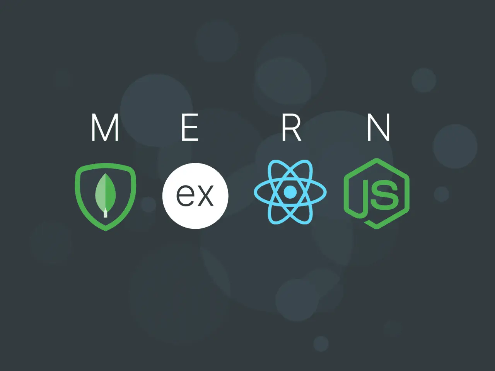

# Question One

We have all heard the saying, "Too many cooks in the kitchen", being apart of a large project can also feel like this and is important to have a standard source control process in place due to developers; changing, updating, manipulating and deleting code in projects that will and can change the integrity of the code. The process typically begins with the initialization of a version control system, such as Git, where a central repository is created to store the project's codebase (Chacon & Straub, 2014).

Source control systems can be categorized into centralized and distributed models. 
Centralized version control systems (CVCS) maintain a single central repository, where all versioned files reside, making it easy to manage access and control changes but creating a single point of failure (Loeliger & McCullough, 2012).

)) reference Altassian

In contrast, distributed version control systems (DVCS), like Git, allow each developer to maintain their own local repository, enabling them to work offline and commit changes independently. This model promotes greater flexibility, as developers can work on features in isolation and merge changes into the central repository when ready (Git Flow, n.d.).

)) reference Altassian

Teams adopt a branching strategy, often employing models like Git Flow or trunk-based development, to manage feature development, bug fixes, and releases. Each team member works on their own branch, allowing them to make changes independently without affecting the main codebase. Regular commits are made with descriptive messages to document changes, fostering a clear history of the project's evolution. Code reviews are conducted through pull requests (PRs), where team members can review, discuss, and suggest modifications before merging changes into the main branch, thereby ensuring code quality and reducing the risk of introducing bugs (Fowler, 2006). Continuous integration (CI) tools are implemented to automate the testing of new code, ensuring that it meets predefined standards and passes all tests before integration. The process also involves tagging stable releases and maintaining documentation that outlines the repository structure, coding standards, and branching strategies. Overall, this structured approach not only enhances collaboration but also contributes to the reliability and maintainability of the software.

References
Chacon, S., & Straub, B. (2014). Pro Git (2nd ed.). Apress.
Fowler, M. (2006). Continuous Integration. Martin Fowler. Retrieved from martinfowler.com
Git Flow. (n.d.). GitFlow Cheatsheet. Retrieved from nvie.com
Loeliger, J., & McCullough, M. (2012). Version Control with Git. O'Reilly Media.

# Question Two

Quality software is defined by several essential attributes that ensure it effectively meets user needs, performs consistently, and can adapt to future requirements. The first aspect is functionality, which encompasses the software’s ability to deliver the features and capabilities that users expect. This involves not only fulfilling specified functional requirements but also addressing non-functional requirements related to how well those functions are executed (Pressman, 2014).

Next, usability is crucial for ensuring that users can interact with the software easily and intuitively. A strong focus on usability means creating interfaces and workflows that minimize complexity and enhance user satisfaction, making the software accessible to a wider audience (Nielsen, 1994). The third aspect, reliability, refers to the software's ability to perform consistently under specified conditions over time. Reliable software should operate without failure, even in unexpected scenarios, and should be able to recover effectively from errors (Beck et al., 2001).

Testability is another vital characteristic, indicating how easily software can be tested for defects and performance issues. High testability simplifies the process of identifying bugs and verifying that the software meets its requirements, ultimately leading to a more robust final product (Meyer, 1997). Following this, security has become increasingly important, particularly in the context of rising cyber threats. Quality software must implement strong security measures to safeguard against unauthorized access and data breaches, thereby ensuring the integrity of user data and maintaining trust (Shostack, 2014).

Lastly, scalability reflects the software’s ability to handle increased loads or adapt to growing user demands without a decline in performance. Scalable software can efficiently manage growth, making it a vital characteristic for applications expected to expand over time (Sommerville, 2011). Together, these six characteristics—functionality, usability, reliability, testability, security, and scalability—create a comprehensive framework for evaluating software quality, ensuring that it is not only effective and user-friendly but also secure and adaptable in a dynamic environment.

References
Beck, K., et al. (2001). Manifesto for Agile Software Development. Agile Alliance.
Meyer, B. (1997). Object-Oriented Software Construction. Prentice Hall.
Nielsen, J. (1994). Usability Engineering. Academic Press.
Pressman, R. S. (2014). Software Engineering: A Practitioner's Approach. McGraw-Hill.
Shostack, A. (2014). Threat Modeling: Designing for Security. Wiley.
Sommerville, I. (2011). Software Engineering. Addison-Wesley.

# Question Three

A standard high-level structure for a MERN (MongoDB, Express, React, Node.js) stack application consists of four key components, each playing an integral role in the overall architecture and functionality of the application.

MongoDB serves as the database layer, utilizing a NoSQL structure that allows for flexible data storage in a JSON-like format known as BSON. This flexibility is particularly beneficial for applications with rapidly changing data requirements, as it permits dynamic schemas and easy scalability. MongoDB's document-oriented approach enables developers to work with complex data structures while maintaining high performance and reliability (MongoDB, 2023).

Next is Express, a minimalist web application framework built on top of Node.js. It simplifies the development of robust APIs by providing essential middleware functions for handling HTTP requests and responses, facilitating routing, and managing sessions and cookies. Express allows developers to build RESTful APIs efficiently, enabling seamless communication between the front-end and back-end (Express, 2023).

On the client side, React empowers developers to create interactive and dynamic user interfaces through a component-based architecture. This approach allows for the reuse of components across the application, leading to more maintainable and efficient code. React's Virtual DOM optimizes rendering, ensuring that updates to the UI are efficient and responsive, which enhances the overall user experience (React, 2023).

Finally, Node.js serves as the foundation of the stack, providing a JavaScript runtime environment that enables server-side scripting. Its event-driven, non-blocking I/O model makes it particularly well-suited for building scalable network applications, allowing developers to handle multiple connections simultaneously without performance degradation (Node.js, 2023).

In a typical MERN application, the flow of data begins with the React front-end making API calls to the Express server. The server processes these requests, interacts with the MongoDB database to retrieve or manipulate data, and sends the results back to the React application, thereby completing the cycle of data exchange. This architecture supports a clear separation of concerns, enhances maintainability, and facilitates the development of scalable web applications (MERN.io, 2022).

References:

Express. (2023). Express.js Documentation. Retrieved from expressjs.com
MongoDB. (2023). MongoDB Documentation. Retrieved from mongodb.com
Node.js. (2023). Node.js Documentation. Retrieved from nodejs.org
React. (2023). React Documentation. Retrieved from reactjs.org
MERN.io. (2022). Getting Started with MERN Stack. Retrieved from mern.io

# Question Four

To successfully develop a website for a small business, a team must possess a comprehensive set of skills and knowledge that span both technical and non-technical domains. First and foremost, proficiency in essential programming languages is crucial. HTML (HyperText Markup Language) and CSS (Cascading Style Sheets) are foundational for creating the structure and style of web pages, while JavaScript is necessary for adding interactivity and dynamic content (W3C, 2023). Familiarity with modern frameworks and libraries, such as React, Angular, or Vue.js, can greatly enhance development efficiency and user experience by allowing developers to build responsive and scalable web applications (Bennett et al., 2021).

Moreover, understanding back-end development is vital. This includes knowledge of server-side programming languages such as PHP, Python, or Node.js, which facilitate the creation of robust server applications that manage data and business logic. Additionally, expertise in database management systems, such as MySQL or MongoDB, is essential for storing, retrieving, and manipulating data efficiently (W3Schools, 2023). Security is another critical area; developers need to implement best practices to protect sensitive information and ensure safe user interactions (OWASP, 2023).

In addition to technical skills, the team should be well-versed in user experience (UX) and user interface (UI) design principles. This includes understanding user-centered design, accessibility standards, and usability testing to create a website that is not only visually appealing but also intuitive and easy to navigate (Norman, 2013). Knowledge of search engine optimization (SEO) is also important, as it helps the website rank better in search engine results, thereby increasing visibility to potential customers (Fishkin, 2015).

Project management skills are equally important for keeping the project organized and ensuring that deadlines are met. Familiarity with methodologies such as Agile or Scrum can enhance collaboration and adaptability throughout the development process (Schwaber & Sutherland, 2020). Furthermore, effective communication skills are vital for liaising with clients, understanding their requirements, and incorporating their feedback into the development process (Smith, 2020). This collaborative approach ensures that the final product aligns closely with the client’s vision and business goals.

In summary, a successful web development project for a small business requires a multidisciplinary approach that combines technical expertise, design sensibility, project management, and strong communication skills. This holistic skill set enables the team to deliver a high-quality, functional, and user-friendly website that meets the specific needs of the business.

References
Bennett, J., et al. (2021). Web Development Essentials. Tech Press.
Fishkin, R. (2015). SEO: The New Media Handbook. O'Reilly Media.
Norman, D. A. (2013). The Design of Everyday Things. Basic Books.
OWASP. (2023). Top Ten Web Application Security Risks. Retrieved from https://owasp.org/
Schwaber, K., & Sutherland, J. (2020). The Scrum Guide. Scrum.org.
Smith, A. (2020). Effective Communication in Web Development. Journal of IT Communication.
W3C. (2023). Web Development Standards. Retrieved from https://www.w3.org/
W3Schools. (2023). Learn SQL. Retrieved from https://www.w3schools.com/sql/

# Question Five

# Question Six
# Question Seven
# Question Eight
# Question Nine
# Question Ten
# Question Eleven
# Question Twelve